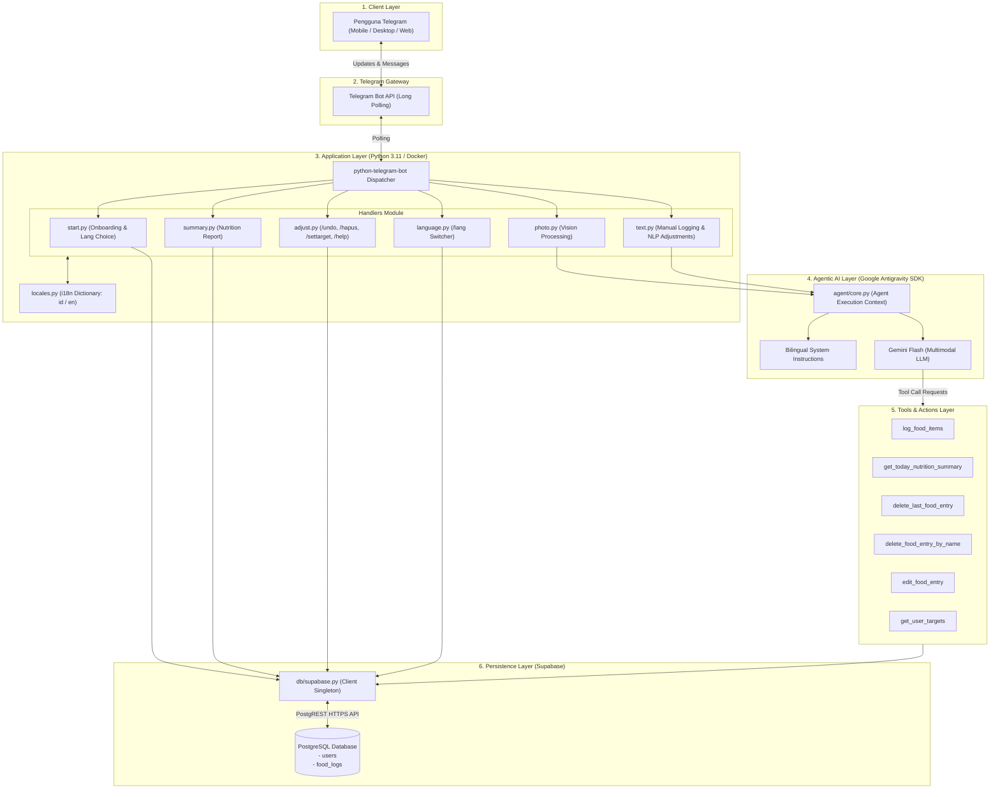
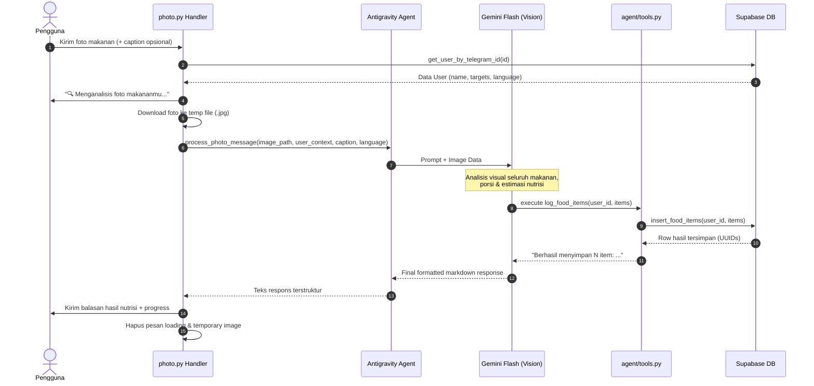
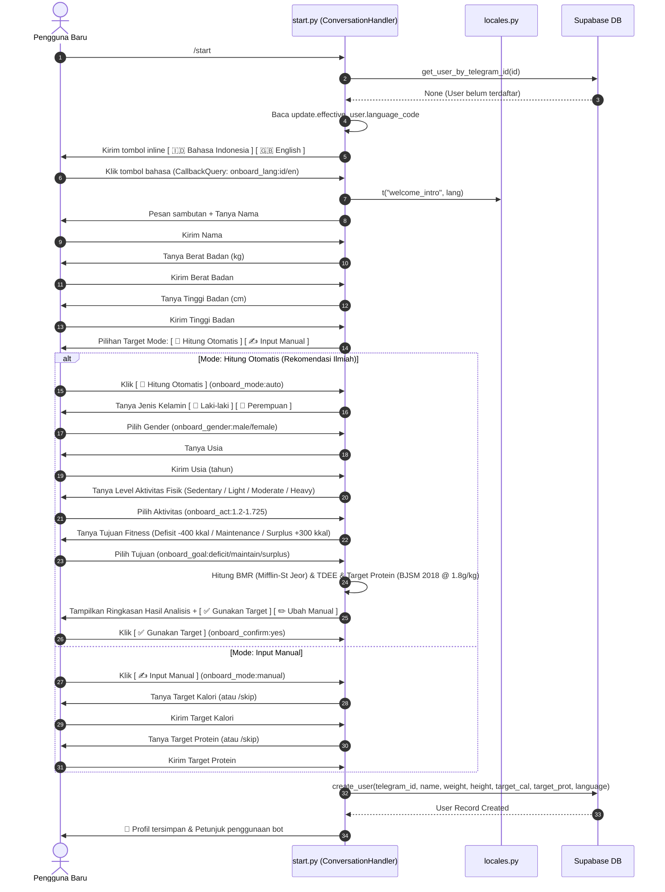
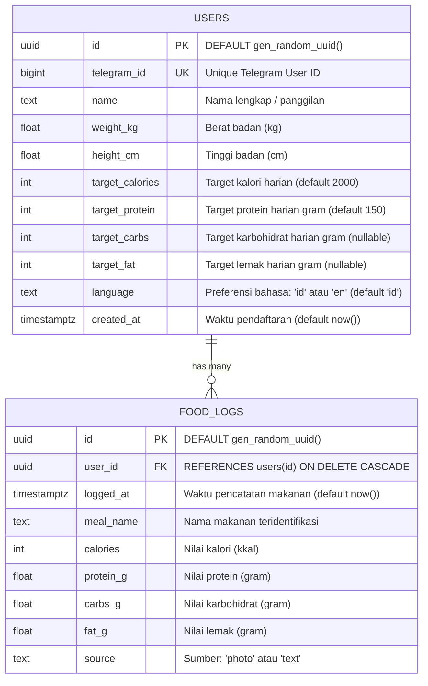
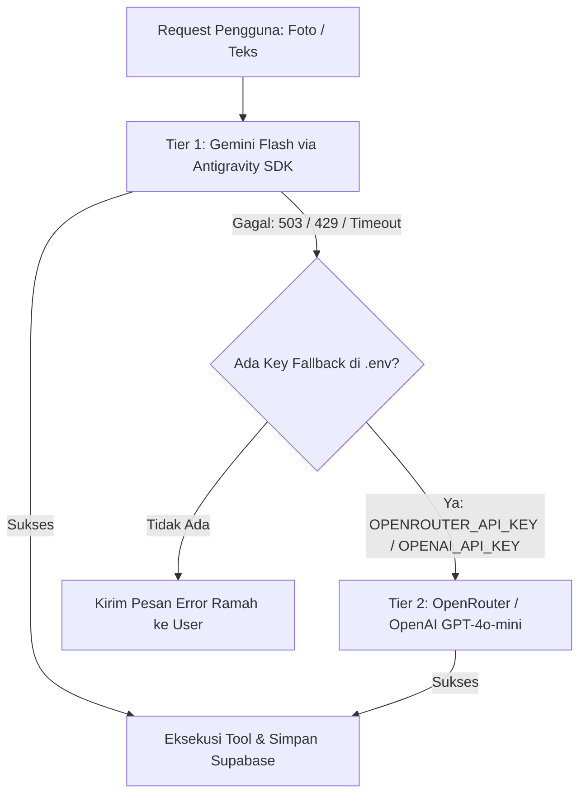

# 📐 CountYourCalories — Technical Architecture & System Design Documentation

Dokumentasi teknis menyeluruh arsitektur sistem, alur data, spesifikasi tools, skema database, sistem internasionalisasi (i18n), dan panduan deployment untuk **CountYourCalories Telegram Bot**.

---

## 📑 Daftar Isi
1. [Ringkasan Sistem (System Overview)](#1-ringkasan-sistem-system-overview)
2. [Diagram Arsitektur Sistem (High-Level Architecture)](#2-diagram-arsitektur-sistem-high-level-architecture)
3. [Alur Kerja & Diagram Urutan (Sequence Diagrams)](#3-alur-kerja--diagram-urutan-sequence-diagrams)
   - [A. Analisis Foto Makanan (Vision & Tool Calling)](#a-analisis-foto-makanan-vision--tool-calling)
   - [B. Alur Onboarding & Pemilihan Bahasa](#b-alur-onboarding--pemilihan-bahasa)
4. [Skema Database & Relasi Data (Data Model & ERD)](#4-skema-database--relasi-data-data-model--erd)
5. [Spesifikasi Agent & Tools (Google Antigravity SDK)](#5-spesifikasi-agent--tools-google-antigravity-sdk)
6. [Sistem Internasionalisasi (i18n Architecture)](#6-sistem-internasionalisasi-i18n-architecture)
7. [Mekanisme Ketahanan & Error Handling (Fault Tolerance)](#7-mekanisme-ketahanan--error-handling-fault-tolerance)
8. [Arsitektur Container & Deployment (Docker & VPS)](#8-arsitektur-container--deployment-docker--vps)
9. [Referensi Perintah & Event (Command Reference)](#9-referensi-perintah--event-command-reference)

---

## 1. Ringkasan Sistem (System Overview)

**CountYourCalories** adalah asisten nutrisi cerdas berbasis Telegram yang mengadopsi pola arsitektur **Agentic AI**. Sistem ini mampu:
1. Mengidentifikasi seluruh komponen makanan dari foto beresolusi tinggi menggunakan kapabilitas visi multimodal **Gemini Flash**.
2. Melakukan estimasi kalori dan makronutrisi (protein, karbohidrat, lemak).
3. Secara otonom memanggil tools Python (*function calling*) untuk menyimpan, mengoreksi, atau menghitung akumulasi nutrisi di database **Supabase (PostgreSQL)**.
4. Berinteraksi secara dwibahasa (**Bahasa Indonesia** 🇮🇩 dan **English** 🇬🇧) secara dinamis.

```
+-----------------------------------------------------------------------------------+
|                                  COUNTYOURCALORIES                                |
|                                                                                   |
|  [ Telegram Client ]  <--->  [ PTB Dispatcher ]  <--->  [ Antigravity Agent ]     |
|                                       |                          |                |
|                                [ i18n Locales ]          [ Gemini Multimodal ]    |
|                                                                  |                |
|                                                         [ Python Tools ]          |
|                                                                  |                |
|                                                      [ Supabase PostgreSQL ]      |
+-----------------------------------------------------------------------------------+
```

---

## 2. Diagram Arsitektur Sistem (High-Level Architecture)



---

## 3. Alur Kerja & Diagram Urutan (Sequence Diagrams)

### A. Analisis Foto Makanan (Vision & Tool Calling)



---

### B. Alur Onboarding & Pemilihan Bahasa



---

## 4. Skema Database & Relasi Data (Data Model & ERD)

Sistem menggunakan database relasional **PostgreSQL** yang di-host di **Supabase** dengan Row Level Security (RLS) terpasang.

### Entity Relationship Diagram (ERD)



### Database Optimization Indexes & RLS:
- `idx_users_telegram_id`: Index B-Tree pada `users(telegram_id)` untuk lookup instan O(1) di setiap interaksi handler.
- `idx_food_logs_user_date`: Index komposit pada `food_logs(user_id, logged_at DESC)` untuk agregasi data harian `/summary`.
- `CASCADE DELETE`: Jika user dihapus, seluruh relasi `food_logs` terkait otomatis terhapus bersih.

---

## 5. Spesifikasi Agent & Tools (Google Antigravity SDK)

Agent diinisialisasi melalui `google.antigravity.Agent` dengan `LocalAgentConfig`.

### Definisi Tools yang Tersedia untuk Agent:

| Nama Tool | Signature | Deskripsi & Fungsi |
|---|---|---|
| `log_food_items` | `(user_id: str, items: list[dict]) -> str` | Menyimpan satu atau banyak item makanan sekaligus ke database Supabase setelah analisis foto/teks. |
| `get_today_nutrition_summary` | `(user_id: str) -> dict` | Menghitung agregat `total_calories`, `total_protein`, `total_carbs`, `total_fat`, dan daftar item hari ini. |
| `delete_last_food_entry` | `(user_id: str) -> str` | Menghapus 1 entri makanan terakhir hari ini (*undo mechanism*). |
| `delete_food_entry_by_name` | `(user_id: str, meal_name: str) -> str` | Menghapus entri makanan berdasarkan kata kunci nama (*case-insensitive & partial match*). |
| `edit_food_entry` | `(user_id: str, meal_name: str, new_values: dict) -> str` | Mengubah nilai nutrisi atau nama makanan pada entri yang sudah tercatat. |
| `get_user_targets` | `(user_id: str, telegram_id: int) -> dict` | Mengambil target kalori dan makronutrisi harian pengguna untuk perbandingan progres. |

---

## 6. Sistem Internasionalisasi (i18n Architecture)

Sistem lokalisasi dirancang dengan arsitektur **Kamus Terpusat (Centralized Key-Value Dictionary)** pada [`bot/locales.py`](file:///c:/Users/daffa/OneDrive/Documents/CountYourCalories/bot/locales.py).

### Hierarki Resolusi Bahasa (Fallback Hierarchy):
1. **User Database Preference**: Bahasa yang tersimpan di kolom `users.language` (`'id'` atau `'en'`).
2. **Telegram Client Language**: Jika user belum terdaftar, gunakan `update.effective_user.language_code`.
3. **Default Fallback**: Jika bahasa tidak didukung, otomatis fallback ke `'id'` (Bahasa Indonesia).

### Dynamic Agent Prompt Injection:
Saat memanggil Agent, bot menyematkan tag preferensi bahasa ke dalam konteks:
- Untuk Bahasa Indonesia: `[Konteks pengguna]: ..., bahasa=id`
- Untuk English: `[User Context]: ..., language=en`

Gemini AI diinstruksikan melalui `SYSTEM_PROMPT` untuk mematuhi tag tersebut dan menghasilkan respons dalam bahasa yang tepat.

---

## 7. Multi-Provider Fallback Switcher (Failover Architecture)

Untuk menjamin ketersediaan bot hingga 99.99% (*Zero Downtime*), sistem dilengkapi arsitektur **Failover Otomatis**:



- **Primary:** Google Gemini Flash (cepat, hemat biaya, default).
- **Secondary Fallback:** Didukung melalui [`bot/agent/fallback.py`](file:///c:/Users/daffa/OneDrive/Documents/CountYourCalories/bot/agent/fallback.py) menggunakan endpoint OpenAI-compatible (OpenRouter dengan model gratis `:free` atau OpenAI `gpt-4o-mini`).
- **Tool Calling Parity:** Semua tool nutrisi (`log_food_items`, `get_today_nutrition_summary`, dll.) dapat dieksekusi secara mulus di kedua provider tanpa perbedaan di database.

---

## 8. Mekanisme Ketahanan & Error Handling (Fault Tolerance)

Sistem dilengkapi beberapa lapisan proteksi agar bot tidak mengalami *crash* atau *unhandled exception*:

1. **Telegram Markdown Fallback**:
   Jika teks respons AI mengandung karakter formatting yang tidak valid untuk parser Telegram (seperti underscore atau pipe yang tidak berpasangan), bot otomatis menangkap `telegram.error.BadRequest` dan mengirim ulang pesan sebagai teks biasa (*plain text*).
2. **Safe Temporary File Cleanup**:
   Pembersihan file gambar temporary pada sistem operasi Windows dan Linux container dibungkus blok `try ... finally` dengan penanganan `PermissionError` dan `FileNotFoundError`.
3. **Execution Timeout Guards**:
   Pemrosesan Agent dibatasi dengan batas waktu `AGENT_TIMEOUT_SECONDS = 90` melalui `asyncio.wait_for()`. Jika koneksi API mengalami timeout, bot merespons user dengan pesan informatif.
4. **Database Schema Fallback**:
   Operasi database CRUD menyematkan fallback jika terjadi *schema mismatch* (misal kolom `language` belum dimigrasi di Supabase).

---

## 8. Arsitektur Container & Deployment (Docker & VPS)

### Spesifikasi Image Docker
- **Base Image:** `python:3.11-slim` (Debian-based, ~150 MB, aman dari bloatware).
- **Timezone:** Dikonfigurasi ke `Asia/Jakarta` (WIB) untuk sinkronisasi penghitungan awal hari (00:00:00).
- **Restart Policy:** `unless-stopped` (otomatis menyala ulang jika container crash atau server reboot).

### Diagram Deployment Docker Compose:

```mermaid
flowchart LR
    subgraph Host ["Host Server (VPS / Cloud / PC)"]
        subgraph DockerEngine ["Docker Engine"]
            subgraph Container ["count-your-calories-bot"]
                App["Python 3.11 Runtime\n(bot.main)"]
            end
        end
        EnvFile[".env (Secrets & API Keys)"] --> Container
    end

    TelegramServer["Telegram Cloud Server"] <--> |Outbound Polling (HTTPS 443)| App
    GeminiServer["Google Gemini API"] <--> |HTTPS 443| App
    SupabaseServer["Supabase PostgreSQL"] <--> |HTTPS 443| App
```

### Perintah Operasional Docker:
```bash
# Build & Jalankan bot di latar belakang (detached mode)
docker compose up -d --build

# Pantau logs aplikasi secara realtime
docker compose logs -f

# Cek status kesehatan container
docker compose ps

# Restart container
docker compose restart

# Hentikan container
docker compose down
```

---

## 9. Referensi Perintah & Event (Command Reference)

| Command / Trigger | Handler | Deskripsi |
|---|---|---|
| `/start` | `start.py` | Memulai alur registrasi & onboarding bilingual, atau menyapa user lama. |
| `/lang` / `/language` | `language.py` | Menampilkan menu inline keyboard untuk mengganti bahasa antarmuka. |
| `/summary` / `/today` | `summary.py` | Menampilkan laporan kalori, protein, karbohidrat, lemak, dan visual progress bar hari ini. |
| `/catat <makanan>` | `text.py` | Mencatat makanan secara manual via teks. |
| `/undo` | `adjust.py` | Menghapus entri makanan terakhir yang dicatat hari ini. |
| `/settarget [kal] [prot]` | `adjust.py` | Mode ganda: Shortcut instan `/settarget 2000 150` ATAU Wizard kalkulator ilmiah otomatis jika diketik `/settarget` saja. |
| `/help` | `adjust.py` | Menampilkan panduan dan daftar seluruh perintah yang tersedia. |
| *(Foto Makanan)* | `photo.py` | Menganalisis foto makanan secara otomatis menggunakan AI multimodal. |
| *(Pesan Teks Bebas)* | `text.py` | Menginterpretasikan perintah penyesuaian natural language (NLP). |
| `onboard_*` | `start.py` | Callback query pada alur onboarding & kalkulator /start. |
| `recalc:*` | `adjust.py` | Callback query pada wizard hitung ulang target ilmiah /settarget. |
| `set_lang:*` | `language.py` | Callback query saat user mengganti bahasa via menu `/lang`. |

---

## 10. Peta Jalan Pengembangan (Future Architecture Roadmap)

Berikut adalah desain arsitektural untuk fitur-fitur yang direncanakan pada iterasi pengembangan berikutnya:

### 10.1 RAG Food Nutrition Reference Database
- **Tujuan:** Meningkatkan presisi angka kalori dan makronutrisi mendekati 100% data uji laboratorium.
- **Rancangan:**
  - Tabel Supabase `food_reference` yang memuat ~500–1.000 data pangan lokal (TKPI Kemenkes RI) dan global (USDA FoodData Central).
  - Tool agent baru: `search_food_reference(query: str) -> list[dict]`.
  - Pola eksekusi: Gemini mendeteksi bahan makanan & gramasi visual, melakukan query ke `food_reference`, menghitung nilai presisi, lalu menyimpannya ke `food_logs`.

### 10.2 Barcode Scanner & Packaged Food Recognition
- **Tujuan:** Memudahkan pencatatan makanan/minuman kemasan (snack, susu, biskuit, suplemen) hanya dengan memfoto barcode produk.
- **Rancangan:**
  - Integrasi API publik *Open Food Facts* via barcode scanner.

### 10.3 Weekly / Monthly Nutrition Analytics & Export
- **Tujuan:** Menyediakan insight tren asupan gizi jangka panjang bagi pengguna.
- **Rancangan:**
  - Command `/analytics` atau `/report` yang menghasilkan grafik visual (PNG) menggunakan `matplotlib` atau ringkasan mingguan.

### 10.4 Water Intake Tracker & Smart Meal Reminders
- **Tujuan:** Memperluas fungsi asisten kesehatan ke hidrasi dan konsistensi jam makan.
- **Rancangan:**
  - Tabel `water_logs` untuk pelacakan asupan cairan harian (`/water` atau `/minum`).
  - Scheduled cron triggers untuk notifikasi pengingat makan pagi, siang, dan malam.

